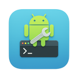

# Android DevKit

A comprehensive VS Code extension that brings core Android development tools directly into your editor — device management, real-time Logcat, wireless debugging, device file explorer, and automatic Android SDK detection.

## Features

### Device Manager

- **Connection type awareness** — classifies each device as Emulator, USB, TCP/IP, or Wireless with a matching icon
- **Wireless debugging** — pair devices via mDNS (Android 11+) and switch USB devices to TCP/IP mode
- **ADB shell** — open an interactive shell for any device in the integrated terminal
- **Screenshots** — capture and save a screenshot from the active device
- **Reboot** — reboot to normal, bootloader, or recovery

### Device File Explorer

- Browse the full file system of any connected device
- **Download** files from the device to your local machine
- **Upload** local files to any directory on the device
- **Delete** files and directories directly from the tree view

### Logcat Viewer

- Real-time log streaming in the VS Code panel area
- Filter by **log level** (Verbose → Fatal)
- Filter by **text** (tag or message content)
- Filter by **package name** — enter a package and logs are automatically scoped to that app's PID
- Color-coded severity via VS Code's native `LogOutputChannel`
- Clear logs, start/stop streaming on demand

### Android SDK Auto-Detection

- Resolves SDK path from `ANDROID_HOME` → `ANDROID_SDK_ROOT` → platform default paths (Android Studio installation locations on macOS, Windows, Linux)
- Status bar item shows the detected SDK path at a glance
- Override via the `androidDevkit.sdkPath` setting if needed

## Requirements

- Android SDK with `adb` accessible (auto-detected, or set `androidDevkit.adbPath`)
- A connected Android device or running emulator

## Usage

1. Open a folder containing an Android project (`build.gradle`, `settings.gradle`, or `AndroidManifest.xml`)
2. The extension activates automatically
3. Click the **Android DevKit** icon in the Activity Bar to manage devices and browse files
4. Open the **Logcat** panel (next to Terminal) to stream logs

## Configuration

| Setting | Description | Default |
|---------|-------------|---------|
| `androidDevkit.adbPath` | Path to the `adb` executable | Auto-detect |
| `androidDevkit.sdkPath` | Path to the Android SDK root | Auto-detect |
| `androidDevkit.logcat.defaultFilter` | Default logcat tag/level filter (e.g. `MyApp:D *:S`) | (empty) |
| `androidDevkit.logcat.maxLines` | Maximum logcat entries kept in memory | `10000` |

## Commands

All commands are available via the Command Palette (`Cmd+Shift+P`) under the **Android DevKit** category:

| Command | Description |
|---------|-------------|
| Refresh Devices | Re-scan for connected devices |
| Connect Device (TCP/IP) | Connect to a device by IP address |
| Pair Device (Wireless Debugging) | Pair a new device using the mDNS pairing code |
| Enable TCP/IP Mode | Switch a USB device to TCP/IP mode on port 5555 |
| Open ADB Shell | Open an interactive shell in the terminal |
| Browse Device Files | Open the Device Files explorer for a device |
| Take Screenshot | Capture a screenshot from the selected device |
| Reboot Device | Reboot the selected device |
| Start / Stop Logcat | Control log streaming |
| Set Logcat Filter | Filter by tag or message text |
| Filter Logcat by Package | Scope logs to a specific app package |
| Clear Logcat | Clear the log output |
| Show Android SDK Info | Display the detected SDK path |

## Links

- [GitHub Repository](https://github.com/pavi2410/android-devkit)
- [Report an Issue](https://github.com/pavi2410/android-devkit/issues)
- [Roadmap](https://github.com/pavi2410/android-devkit/blob/main/ROADMAP.md)

## License

MIT
